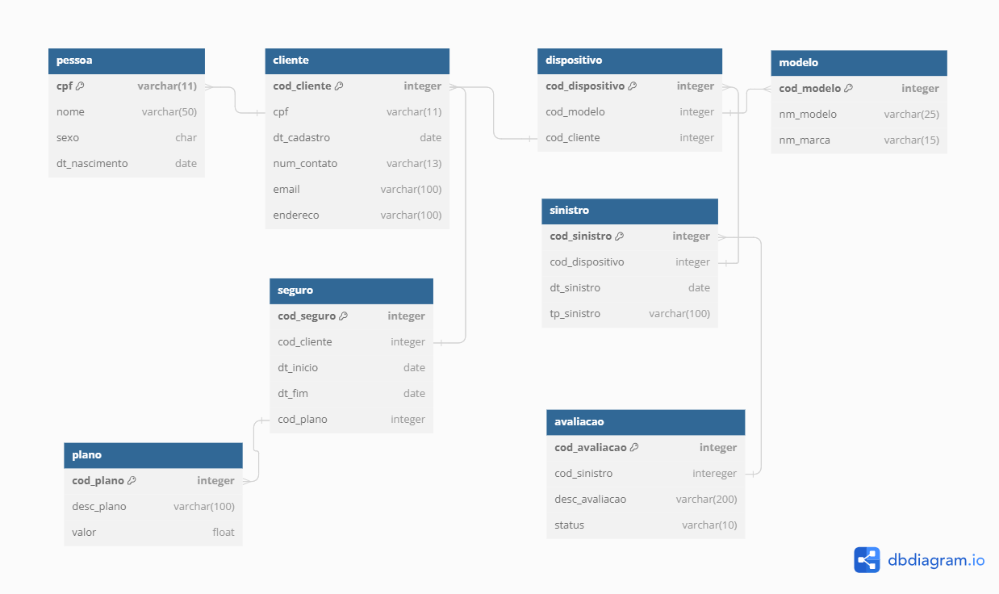

# Banco-2-o-Trabalho-Final.
Este repositório é para conter as informações de criação e atualização do projeto de final de semestre de Banco de Dados II. 

## Integrantes do Grupo ( github )
	kaiquedm12
 	paulos-f
	GeovaneVDS
 	JogadorZero
  	AndreLuizOenning
	BrunoAiolfi

## Desenvolvimento inicial do projeto:
### 04/06/2024

tabelas:
	
	pessoas
		nome,
		cpf PK,
		sexo,
		data nasc
		endereço	

	
	clientes
		FK PESSOA
		id PK
		data de cadastro
		numero contato
		email contato
	
	dispositivo
		id PK
		FK MODELO
		FK CLIENTE
		numero	
	
	modelo
		id PK
		nome
		FK MARCA
	
	marca 
		id PK
		nome
		
	apolice (seguro)
		id pk
		FK CLIENTE
		FK APOLICE_TIPO_APOLICE
		data criação
		data fim
		fk valor 
	
	apolice_tipo_apolice
		id pk
		fk apolice
		fk tipo apolice
	
	tipo apolice (tipo seguro)
		id pk
		fk tipo sinistro
		desc
	
	valor
		id
		valor
		fk apolice
	
	sinistro 
		id pk
		desc
		fk cliente
		fk dispositivo
	
	sinistro_tipo_sinistro
		id pk
		fk tipo sinistro
		fk sinistro
	
	tipo sinistro
		id pk
		desc 

### 11/06/2024

termino das tabelas:

	CREATE TABLE [cliente] (
	  [cod_cliente] integer PRIMARY KEY not null,
	  [cpf] varchar(11) not null,
	  [nome] varchar(50) not null,
	  [sexo] char,
	  [dt_nascimento] date not null
	  [dt_cadastro] date not null,
	  [num_contato] varchar(13) not null,
	  [email] varchar(100),
	  [endereco] varchar(100)
	)
	GO
	
	CREATE TABLE [modelo] (
	  [cod_modelo] integer PRIMARY KEY not null,
	  [nm_modelo] varchar(25) not null
	)
	GO
	
	CREATE TABLE [marca] (
	  [cod_marca] integer PRIMARY KEY not null,
	  [cod_modelo] integer not null,
	  [nm_marca] varchar(15) not null
	)
	GO
	
	
	CREATE TABLE [dispositivo] (
	  [cod_dispositivo] integer PRIMARY KEY not null,
	  [cod_modelo] integer not null,
	  [cod_cliente] integer not null
	)
	GO
	
	CREATE TABLE [plano] (
	  [cod_plano] integer PRIMARY KEY not null,
	  [desc_plano] varchar(100),
	  [valor] float not null
	)
	GO
	
	CREATE TABLE [seguro] (
	  [cod_seguro] integer PRIMARY KEY not null,
	  [cod_cliente] integer not null,
	  [dt_inicio] date not null,
	  [dt_fim] date not null,
	  [cod_plano] integer not null
	)
	GO
	
	CREATE TABLE [sinistro] (
	  [cod_sinistro] integer PRIMARY KEY not null,
	  [cod_dispositivo] integer not null,
	  [tp_sinistro] integer not null,
	  [dt_sinistro] date not null,
	)
	GO
	
	CREATE TABLE [tipo_sinistro] (
	  [tp_sinistro] integer PRIMARY KEY not null,
	  [desc_sinistro] varchar(100) not null
	)
	GO
	
	
	ALTER TABLE [marca] ADD FOREIGN KEY ([cod_modelo]) REFERENCES modelo ([cod_modelo])
	GO
	
	ALTER TABLE [sinistro] ADD FOREIGN KEY ([tp_sinistro]) REFERENCES tipo_sinistro ([tp_sinistro])
	GO
	
	ALTER TABLE [dispositivo] ADD FOREIGN KEY ([cod_cliente]) REFERENCES cliente ([cod_cliente])
	GO
	
	ALTER TABLE [dispositivo] ADD FOREIGN KEY ([cod_modelo]) REFERENCES [modelo] ([cod_modelo])
	GO
	
	ALTER TABLE [sinistro] ADD FOREIGN KEY ([cod_dispositivo]) REFERENCES [dispositivo] ([cod_dispositivo])
	GO
	
	ALTER TABLE [avaliacao] ADD FOREIGN KEY ([cod_sinistro]) REFERENCES [sinistro] ([cod_sinistro])
	GO
	
	ALTER TABLE [seguro] ADD FOREIGN KEY ([cod_cliente]) REFERENCES [cliente] ([cod_cliente])
	GO
	
	ALTER TABLE [seguro] ADD FOREIGN KEY ([cod_plano]) REFERENCES [plano] ([cod_plano])
	GO

